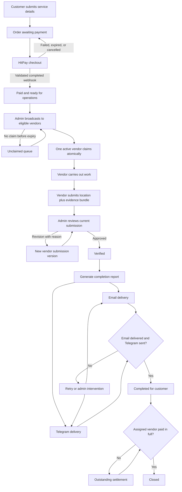

# Flow Spec: Production platform lifecycle

## Goal

Make one paid As-Sabiquun service traceable from customer checkout through vendor fulfilment, admin verification, customer delivery, and final vendor settlement without allowing any role or integration to skip a required step.

This is a logic and data-integrity specification. It does not prescribe a visual redesign.

## Audit conclusion

The product has the right three actors and the right broad sequence. The main weakness is that several independent facts are compressed into one mutable `orders.status` value. Customer payment, field fulfilment, report delivery, and vendor settlement can therefore contradict each other.

The production model should preserve three customer-facing milestones:

- **Verified:** an admin approved the latest complete vendor submission.
- **Completed:** the verified completion report was delivered by Brevo Email and accepted by Telegram as a sent document.
- **Closed:** the project is completed and the assigned vendor has been paid in full.

Those labels should be derived from separate workflow axes, not used as substitutes for them.

## Evidence reviewed

### Project at the pre-production audit

- Next.js application routes for customers, vendors, admins, checkout forms, OAuth, password auth, reports, and job records.
- Supabase migrations `001` through `008`, including RLS and SECURITY DEFINER lifecycle functions. Migrations `009` through `014` were implemented after this audit; current delivery status is tracked in the [implementation plan](./plan.md).
- The live Supabase data shape using aggregate-only, read-only queries.
- Existing saved Mobbin-led specs for Shopify order operations, Linear status hierarchy, Stripe dashboard restraint, Attio login, and Wise dashboard hierarchy.

Live Mobbin search could not be refreshed during this audit because its refresh token had already been used. No claim in this document depends on an uncaptured Mobbin screen.

### External product logic references

- [HitPay online payments](https://docs.hitpayapp.com/apis/guide/online-payments): an order must be marked paid only after a signed webhook is received and validated.
- [Upwork fixed-price review](https://support.upwork.com/hc/en-us/articles/17974824831507--Review-and-pay-for-fixed-price-contracts-and-milestones): submitted work enters review, can be returned for changes, and is resubmitted through the same controlled loop.
- [charity: water completed project record](https://www.charitywater.org/projects/562-44): a project is published after the partner's final report is approved, with project ID, local partner, GPS, location, photos, and project facts.
- [GlobalGiving project reports](https://www.globalgiving.org/projects/support-community-led-humanitarian-response/reports/): reports remain attached to the project and donors can receive update emails.
- [Supabase user invitations](https://supabase.com/docs/guides/auth/users): staff-created users should receive an invitation and set their own password rather than receive a shared plaintext password.
- [Supabase MFA](https://supabase.com/docs/guides/auth/auth-mfa): admin access can require Authenticator Assurance Level 2 in both application guards and restrictive RLS policies.
- [Stripe separate charges and transfers](https://docs.stripe.com/connect/separate-charges-and-transfers): customer charges and service-provider transfers are separate financial records, matching As-Sabiquun's requirement to separate fulfilment from vendor settlement. This is a structural reference, not a recommendation to replace HitPay.

## Pre-production audit baseline

> This section preserves the evidence that motivated migrations `009` through `014`; it is not a description of the current runtime. See the [implementation plan](./plan.md) for current status.

### What is sound

- Roles come from `profiles.role`, not editable OAuth metadata.
- Customer, vendor, and admin layouts independently check the authenticated user's role and active status.
- Customer order ownership, assigned-vendor access, and admin access are protected by RLS.
- Vendor claiming is atomic: the first eligible vendor to claim wins.
- Commission and vendor payout amounts are snapshotted on order creation.
- Vendor evidence follows the required 9-photo and 4-video category structure.
- Admin approval and revision are separate branches.
- Customer delivery and vendor settlement are conceptually separate.
- Customers and vendors can file support reports, and admins can resolve them.

### Live data snapshot at audit time

- 5 profiles: 1 admin, 3 customers, 1 vendor; all active.
- 3 orders: 2 submitted, 1 completed.
- All 3 orders have `payment_status = pending`.
- 13 categorized proof rows exist.
- 1 claimed vendor offer exists.
- 0 vendor payments and 0 customer reports exist.
- The completed order has neither Email nor Telegram recorded as delivered.

This may be demo/test history, but it proves the database currently permits states the product says should be impossible.

## Canonical state model

### 1. Customer payment

`pending -> paid -> partially_refunded | refunded`

Failure branches: `pending -> failed | expired | cancelled`.

Only a validated HitPay webhook may set `paid`, `failed`, `expired`, or refund states. A browser redirect is never payment confirmation.

### 2. Fulfilment

`not_ready -> ready -> broadcasting -> assigned -> in_progress -> proof_submitted -> verified`

Branches:

- `broadcasting -> ready -> broadcasting` after an offer window expires and the job is rebroadcast.
- `proof_submitted -> revision_required -> proof_submitted` with a new immutable submission version.
- eligible pre-fulfilment states may move to `cancelled` through a dedicated cancellation function.

### 3. Customer delivery

`not_ready -> queued -> partial | failed -> delivered`

Each Email and Telegram attempt has its own immutable provider result. Overall delivery is `delivered` only when Brevo confirms Email delivery and Telegram returns a successful sent message ID. Telegram bots cannot claim customer-read delivery.

### 4. Vendor settlement

`unpaid -> partially_paid -> paid`

Settlement is calculated from validated ledger entries for the assigned vendor, order, currency, and vendor-payout amount.

### 5. Overall display milestone

The application derives, but does not freely edit:

- **Verified** when fulfilment is verified.
- **Completed** when fulfilment is verified and customer delivery is complete.
- **Closed** when completed and vendor settlement is paid in full.

## Lifecycle diagram

## Required invariants

1. An order cannot be broadcast unless the customer payment is confirmed paid.
2. `broadcast_order` only accepts the intended source states and cannot reopen verified, completed, closed, cancelled, or refunded work.
3. Only an active vendor with an unexpired offer may claim.
4. Suspension blocks vendor RPCs and Storage uploads immediately, even for an existing session.
5. A proof submission must reference real objects under the assigned vendor/order path.
6. The latest submission must contain every required evidence slot, mandatory location fields, GPS coordinates, and vendor remarks before entering review; additional evidence remains separate.
7. Every resubmission is versioned; old evidence and review decisions remain readable in the audit trail.
8. Admin approval is possible only for the latest complete submission.
9. The legacy `complete_order` bypass is removed or execution is revoked.
10. Delivery state is written by real provider results; admins may retry or override with an explicit reason, never silently simulate a send.
11. A failed delivery after completion reopens delivery and makes the order no longer completed/closed until corrected.
12. A vendor payment must match the order's assigned vendor and currency.
13. Job-linked payments cannot exceed the outstanding vendor payout unless a separately typed adjustment is recorded.
14. A payment reference or idempotency key cannot be recorded twice.
15. `closed` is derived only when verification, both customer deliveries, and full vendor settlement are all true.
16. Customer impact counts and monetary totals include paid orders only; completion counts include delivered orders only.
17. Every mutation writes an immutable actor-attributed event.

## Recommended data changes

Reuse the existing tables and add only the records needed to preserve history:

- `orders`: retain the commercial snapshot; separate fulfilment, payment, delivery, and settlement state or expose them through a database view.
- `payment_transactions`: HitPay request ID, event ID, amount, currency, provider status, timestamps, and idempotency key.
- `completion_submissions`: one row per vendor submission version with location, remarks, submitted time, review outcome, reviewer, and review note.
- `proofs`: add `submission_id`; keep one immutable evidence row per uploaded object.
- `notification_deliveries`: one row per Email/Telegram attempt with provider ID, status, error, and timestamps.
- `vendor_payments`: add currency and idempotency/reference constraints; require a validated order/vendor relationship.
- `order_events`: append-only audit events for every transition and integration result.

The two existing support-report tables can remain for the MVP. Record the resolution note, resolver, and resolution time; a unified ticketing abstraction or separate support-email system is not needed.

## Authentication and authorization

### Customer

- Customer access is Google-only and requires a verified Google email.
- Google OAuth may create customer profiles only; vendor and admin roles are invitation-only.
- Checkout drafts and same-origin return paths survive Google sign-in and required Telegram linking without duplicating an order.

### Vendor

- Admin enters the vendor organisation and email.
- Supabase sends an invitation link; the vendor chooses their own password.
- Vendor completes profile/bank details and remains pending until approved.
- No vendor Google OAuth is needed for MVP.

### Admin

- `/admin` remains unlinked from the public site.
- Admin accounts are manually invited/promoted.
- Require MFA/AAL2 before reading customer data, evidence, bank details, or performing mutations.
- Enforce AAL2 in restrictive RLS as well as the Next.js layout.

## Role-specific product result

### Customer portal

- The graph counts paid services started and verified fulfilments.
- The board remains read-only.
- Order detail shows payment receipt, current status, location once approved, completion report, reviewed media, and notification status.
- Cancelled/failed/expired checkouts are visible in history but excluded from impact.

### Vendor portal

- The offer shows payout, scope, deadline, location expectations, and evidence requirements before acceptance.
- The payout displayed is `vendor_payout_amount`, never the customer package price.
- Upload is resumable as a draft; final submission is one explicit operation.
- Revision reasons and earlier submission versions remain available.
- Earnings distinguish committed, pending approval, payable, paid, and outstanding.

### Admin portal

- The default queue is grouped by next required action, not merely raw status.
- Admin can see payment truth, fulfilment truth, delivery truth, and settlement truth independently.
- Review has an evidence checklist and cannot approve an incomplete submission.
- Notification actions send/retry the actual report and show provider results.
- Vendor payment entry validates vendor, order, currency, outstanding amount, and reference.
- The audit timeline reads immutable events rather than reconstructing history from mutable columns.

## Acceptance criteria

These boxes remain release gates. Code-complete status and the smaller external-configuration checklist are tracked in the [implementation plan](./plan.md) and [operations runbook](./operations.md).

- [ ] No unpaid order can enter vendor fulfilment.
- [ ] No active workflow can skip proof review or customer delivery.
- [ ] Suspended vendors cannot mutate data through direct RPC or Storage calls.
- [ ] Revisions preserve every prior submission and review reason.
- [ ] HitPay webhook processing is signature-validated and idempotent.
- [ ] Brevo Email and Telegram attempts are real, retryable, and auditable.
- [ ] Vendor payments cannot be mismatched, duplicated, overpaid, or recorded in an ambiguous currency.
- [ ] Customer impact metrics exclude unpaid, failed, cancelled, and test records.
- [ ] Admin access to sensitive operations requires AAL2.
- [ ] RLS tests cover every role and every sensitive table/function.
- [ ] Lifecycle integration tests cover every happy path and failure branch.
- [ ] Full lint, TypeScript, production build, and responsive portal QA pass.
